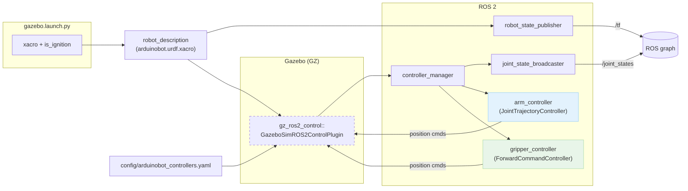

# Clase 49 · Configure **ros2_control** (Arduinobot)

En esta clase integramos **ros2_control** al robot *Arduinobot* para controlarlo en **Gazebo (ros_gz_sim)**.  
Se creó un paquete dedicado para la configuración, se añadieron los controladores y se ajustaron los *launch* y los Xacro necesarios.

---

## 🎯 Objetivos
- Crear un paquete `arduinobot_controller` para alojar la configuración de control.
- Definir controladores del brazo y del *gripper* en `arduinobot_controllers.yaml`.
- Instalar la carpeta `config/` vía `CMakeLists.txt`.
- Conectar el plugin **gz_ros2_control** desde los Xacro del robot.
- Lanzar la simulación con `gazebo.launch.py` pasando los parámetros correctos a `xacro`.

---

## 📝 Notas de clase (comandos usados)

```bash
# Crear el paquete de control
ros2 pkg create --build-type ament_cmake arduinobot_controller

# Compilar el workspace
colcon build
. install/setup.bash

# (Tras editar archivos)
colcon build
. install/setup.bash

# Lanzar la simulación
ros2 launch arduinobot_description gazebo.launch.py 
```

---

## 📁 Estructura (vista general del workspace)

> Captura de la estructura de carpetas de la clase.


---

## ⚙️ `arduinobot_controllers.yaml` (configuración de control)

Archivo: `src/arduinobot_controller/config/arduinobot_controllers.yaml`

Este archivo define los parámetros para `controller_manager` y la configuración de dos controladores:
- **Brazo**: `arm_controller` → `joint_trajectory_controller/JointTrajectoryController`
- **Gripper**: `gripper_controller` → `forward_command_controller/ForwardCommandController` (simple para la prueba)
- **Broadcaster**: `joint_state_broadcaster/JointStateBroadcaster` para publicar `/joint_states`.

> **Importante:** en ROS 2 los parámetros deben ir bajo la clave **`ros__parameters`**.

```yaml
controller_manager:
  ros__parameters:                        # Siempre debe usarse 'ros__parameters' en ROS 2
    update_rate: 10                       # Frecuencia de actualización de los controladores

    arm_controller:
      type: joint_trajectory_controller/JointTrajectoryController   # Controlador de trayectorias de las articulaciones

    gripper_controller:
      #type: joint_trajectory_controller/JointTrajectoryController  # (Alternativa comentada)
      type: forward_command_controller/ForwardCommandController     # Controlador simple para abrir/cerrar gripper

    joint_state_broadcaster:
      type: joint_state_broadcaster/JointStateBroadcaster           # Publica estados de todas las articulaciones

arm_controller:
  ros__parameters:
    joints:
      - joint_1
      - joint_2
      - joint_3

    command_interfaces:
      - position                 # Interfaz de comandos: posición
    state_interfaces:
      - position                 # Interfaz de estados: posición

    open_loop_control: true      # Permite control en lazo abierto
    allow_integration_in_goal_trajectories: true   # Permite integración en trayectorias de objetivos

gripper_controller:
  ros__parameters:
    joints:
      - joint_4                  # Gripper controlado como una sola articulación

    interface_name: position     # Interfaz que recibe comandos de posición

    #command_interfaces:
    # - position
    #state_interfaces:
    #  - position
    #open_loop_control: true
    #allow_integration_in_goal_trajectories: true
```

> **Sugerencia:** para controles más suaves puedes subir `update_rate` a `100` Hz o más.

---

## 🛠️ `CMakeLists.txt` (instalación de `config/`)

Archivo: `src/arduinobot_controller/CMakeLists.txt`

Añadimos la instalación de la carpeta `config` para que el YAML quede disponible en `share/${PROJECT_NAME}`:

```cmake
# Después de find_package(...) y del resto de configuración:
install(
  DIRECTORY config
  DESTINATION share/${PROJECT_NAME}
)
```

---

## 🤖 Xacro / URDF

### `arduinobot.urdf.xacro`
Modelo base del robot (incluye enlaces, articulaciones y *macros* Xacro).

### `arduinobot_gazebo.xacro` y `arduinobot_ros2_control.xacro`
Integran el robot con Gazebo y el plugin de control.  
Asegúrate de usar **gz_ros2_control** (renombrado desde ign_ros2_control).  
Ejemplo de **bloque del plugin** dentro de `<gazebo> ... </gazebo>`:

```xml
<gazebo>
  <plugin filename="gz_ros2_control-system"
          name="gz_ros2_control::GazeboSimROS2ControlPlugin">
    <ros>
      <namespace>/</namespace>
    </ros>
    <parameters>
      $(find-pkg-share arduinobot_controller)/config/arduinobot_controllers.yaml
    </parameters>
  </plugin>
</gazebo>
```

> Colocar `<plugin>` **siempre dentro** del bloque `<gazebo>`.  
> Si usas nombres antiguos (`ign_ros2_control`), verás un *warning* recomendando esta versión.

---

## 🚀 `gazebo.launch.py`

Archivo: `src/arduinobot_description/launch/gazebo.launch.py`

Responsable de:
- Procesar el modelo con **xacro** (`arduinobot.urdf.xacro`) y publicarlo en `robot_state_publisher`.
- Pasar el argumento **`is_ignition`** a `xacro` (verdadero en Humble).
- Lanzar Gazebo y el *bridge* de sensores.

> **Detalle práctico:** al construir el comando `xacro`, asegúrate de no “pegar” el parámetro al nombre del archivo. El formato debe quedar como:
>
> ```bash
> xacro <ruta/al/arduinobot.urdf.xacro> is_ignition:=True
> ```
>
> En Python/Launch, genera el argumento `is_ignition:=<valor>` como **un único token** (no lo separes en dos).

---

## ▶️ Ejecución

```bash
colcon build
. install/setup.bash
ros2 launch arduinobot_description gazebo.launch.py
```

Verificaciones útiles:

```bash
# Ver controladores cargados/activos
ros2 control list_controllers

# Ver estados de articulaciones
ros2 topic echo /joint_states
```

---

## 🧩 Diagrama (Mermaid)



---

## 🛡️ Consejos y *troubleshooting*

- **Renombre del plugin:** si ves un aviso sobre `ign_ros2_control` → usa `gz_ros2_control` como en el ejemplo.
- **Frecuencia de control:** si aparece  
  *“Desired controller update period (0.1 s) is slower than the gazebo simulation period (0.001 s)”*,  
  sube `update_rate` (p. ej., `100` Hz o `1000` Hz) en el YAML.
- **Parámetros YAML:** siempre bajo `ros__parameters`.  
- **Juntas mimetizadas:** si el *gripper* usa dos dedos, puedes mimetizar `joint_5` con `joint_4` con factor `-1` (correcto para dedos en espejo).
- **xacro:** asegúrate de que los parámetros de `xacro` se pasen como tokens correctos, p. ej. `is_ignition:=True`.

---

## ✅ Resultado
Tras estos pasos, el robot se lanza en Gazebo con `controller_manager`, el *broadcaster* de estados y los controladores del brazo y *gripper* listos para recibir comandos.

---

### Archivos clave tratados en esta clase
- `src/arduinobot_controller/config/arduinobot_controllers.yaml`
- `src/arduinobot_controller/CMakeLists.txt`
- `src/arduinobot_description/urdf/arduinobot_gazebo.xacro`
- `src/arduinobot_description/urdf/arduinobot.urdf.xacro`
- `src/arduinobot_description/launch/gazebo.launch.py`
